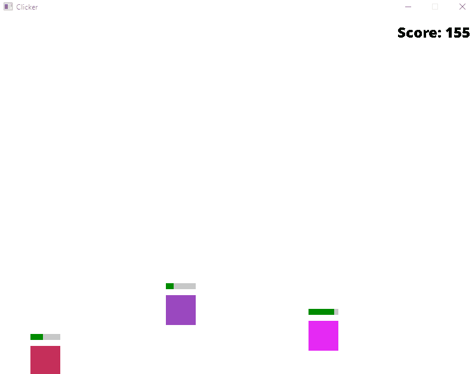

# Clicker

A clicker game written in C++ using the SDL2 library.

Click the box, make the number go up!

  

## Build

Assuming you are currently in the project folder (`clicker`)

```bash
cd clicker
mkdir build
cd build
cmake ..
cd ..
cmake --build build
```

Then you can run the executable in the build folder.

**Note:**

- Be careful of the assets folder, the path is relative to where you run the executable.  Eg. if you run the executable from the project root folder (`clicker`), the path to the assets folder will be `./assets/...` and if you run it from the build folder, the path will be `../assets/...`.

## Project structure

```bash
clicker
├── assets
│   └── fonts
│       └── open-sans
│           └── OpenSans-ExtraBold.ttf
├── build
├── cmake
│   └── sdl2
│       ├── FindSDL2.cmake
│       ├── FindSDL2_image.cmake
│       └── FindSDL2_ttf.cmake
├── lib
│   ├── SDL2
│   ├── SDL2_image
│   └── SDL2_ttf
├── src
│   └── main.cpp
├── .gitignore
├── .gitmodules
├── CMakeLists.txt
├── README.md
└── screenshot.gif
```
